# GBAWii3-Boards (GBAdWiince V3)

This project includes 3 boards specifically designed for the [GBAWii3 handheld Wii project](https://bitbuilt.net/forums/threads/summer-contest-2025-gb-adwiince-v3-revenge.6912/). A portable Nintendo Wii built into a Game Boy Advance–style shell.
### It includes:
- MelonLORD is a connector board. It connects directly to the [ThunderKILL](https://github.com/RoseDaggerDev/ThunderKILL) for power, then distributes that power and signal lines between EastECHO and GhostPAW. It houses the [MelonHD](https://github.com/mackieks/melonHD/blob/main/README.md) by [YveltalGriffin](https://github.com/mackieks) for HDMI to USB C DP alt mode. Along with an HDMI MUX for switching between internal and external displays, the USB C port for charging and display out, and the microSD card slot with SD to USB adapter.
- EastECHO provides a backplane for the right side controller buttons and joystick. It also houses the Wii’s MX chip, clock battery, and an audio interface based on [Scampi](https://github.com/mackieks/scampi) by [YveltalGriffin](https://github.com/mackieks). It is connected to MelonLORD and the [RainbowBRIDGE](https://github.com/RoseDaggerDev/RainbowBRIDGE).
- GhostPAW provides the backplane for the left side controller buttons and joystick. It also houses the Wii Bluetooth module and a GameCube controller chip based on [GCPlus-2.0](https://github.com/Aurelio92/GCPlus-2.0) by [Aurelio92](https://github.com/Aurelio92). It is connected to the [ThunderKILL](https://github.com/RoseDaggerDev/ThunderKILL) and MelonLORD.

### Purpose:
The GBAWii3-Boards project provides the custom PCBs used in the GBAWii3 handheld, a portable Wii built inside a Game Boy Advance styled shell. The three boards (MelonLORD, EastECHO, and GhostPAW) demonstrate system-level PCB design, integrating power management, video routing, audio, controller input, and console subsystems into a compact handheld form factor. While these boards are not intended as standalone hardware, they highlight skills in multi-board design, modular interconnects, and adapting open-source components (e.g. MelonHD, Scampi, GCPlus-2.0) into a unified portable system.

### ToDo:
- Final design pass on the boards
- Send PCBs for fabrication
- Solder components
- Test with the Wii
- Final assembly of GBAWii3

### FINAL NOTE: MelonLORD, EastECHO and GhostPAW are still in the prototype phase and untested. PCB manufacturing is not recommended until development and testing are complete.

(This github page is still WIP, and will change as the project continues)

## Screenshots

### GBAWii3

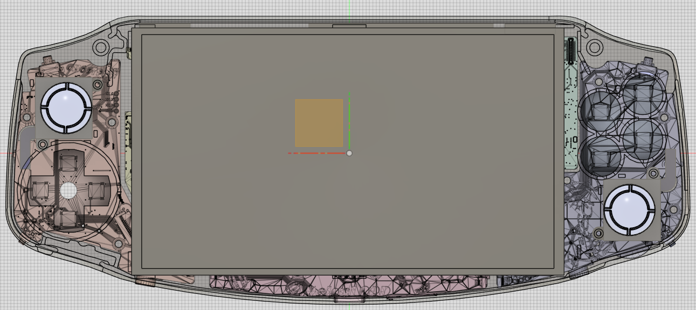

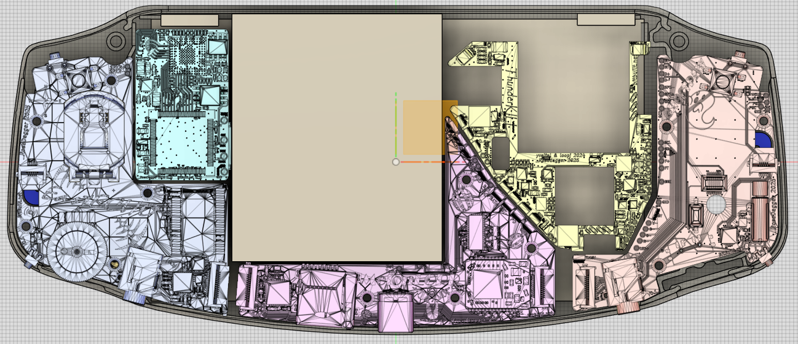

### MelonLORD

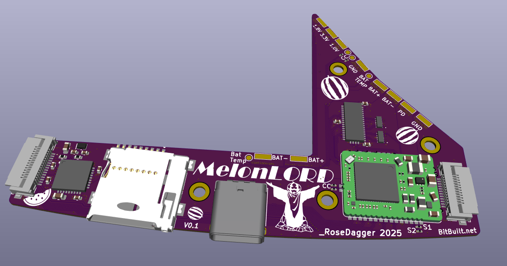

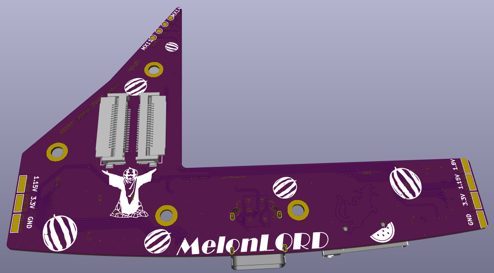

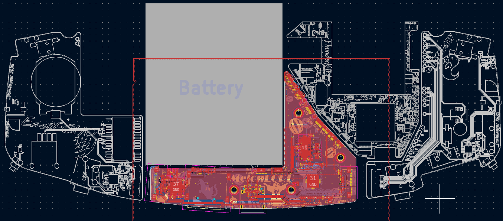

### EastECHO

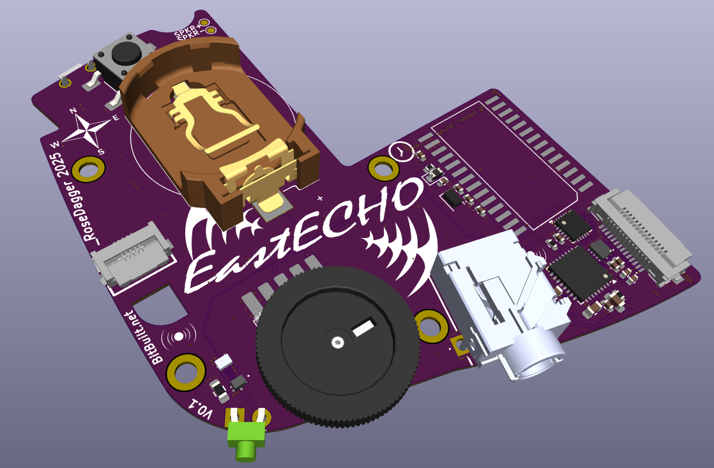

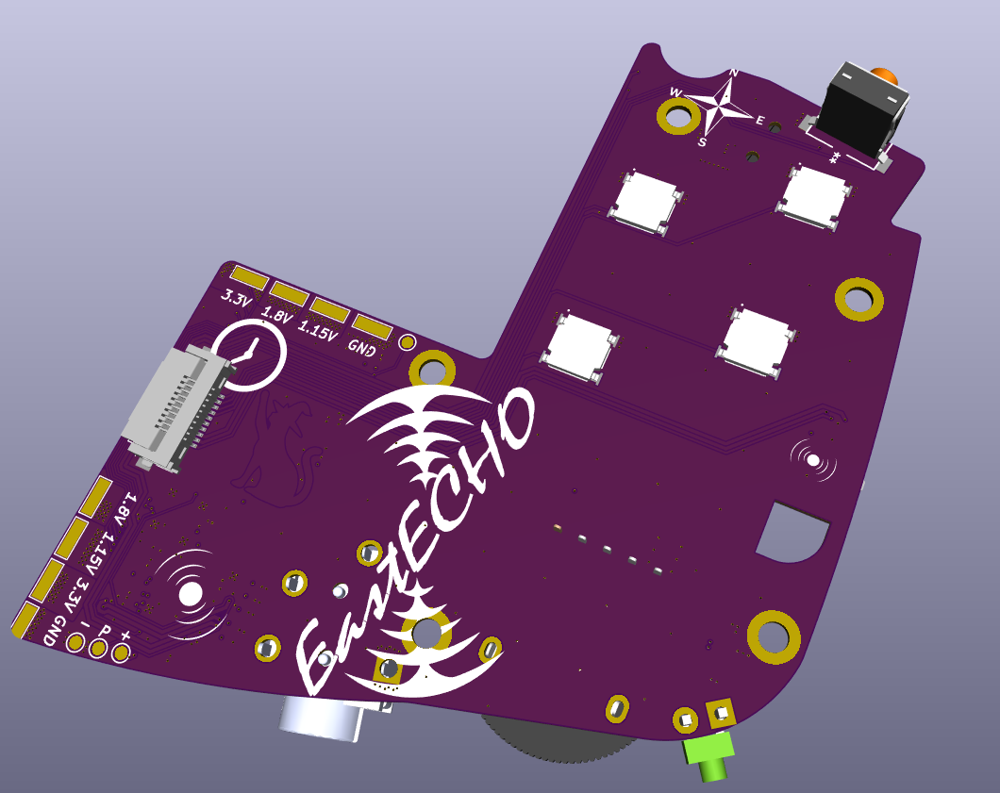

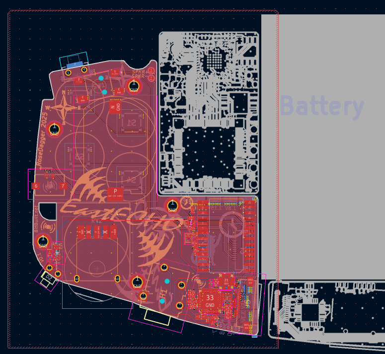

### GhostPAW

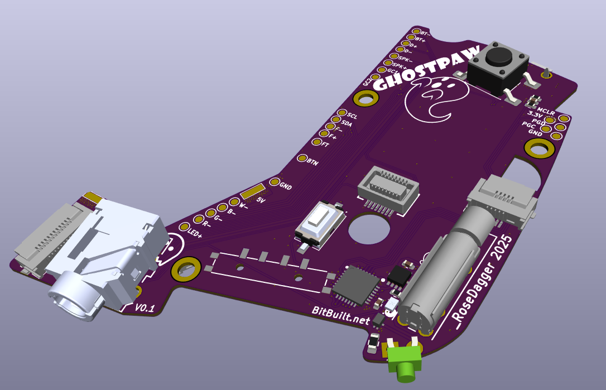

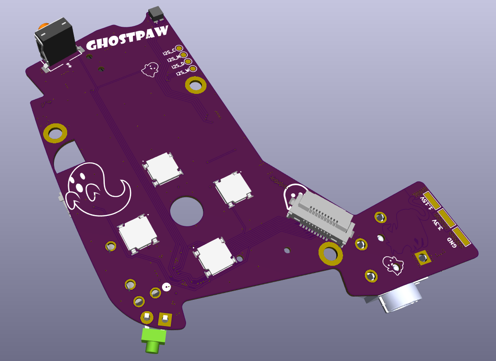

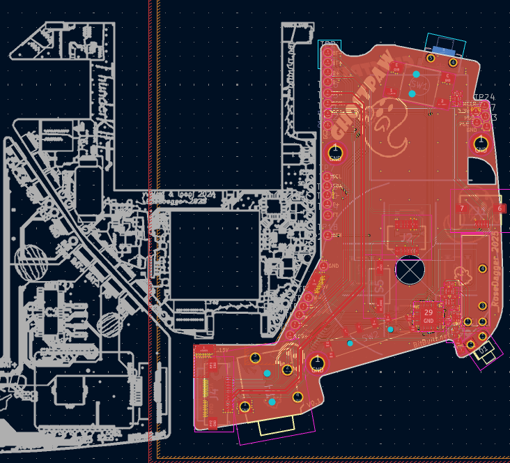

## Credits

MelonLORD hardware designed by [RoseDaggerDev](https://github.com/RoseDaggerDev)

EastECHO hardware designed by [RoseDaggerDev](https://github.com/RoseDaggerDev)

GhostPAW hardware designed by [RoseDaggerDev](https://github.com/RoseDaggerDev)

[MelonHD](https://github.com/mackieks/melonHD/blob/main/README.md) by [YveltalGriffin](https://github.com/mackieks)

[Scampi](https://github.com/mackieks/scampi) by [YveltalGriffin](https://github.com/mackieks)

[GCPlus-2.0](https://github.com/Aurelio92/GCPlus-2.0) by [Aurelio92](https://github.com/Aurelio92)

## License

MelonLORD, EchoEAST and GhostPAW hardware is licensed under Solderpad Hardware License v2.1.
